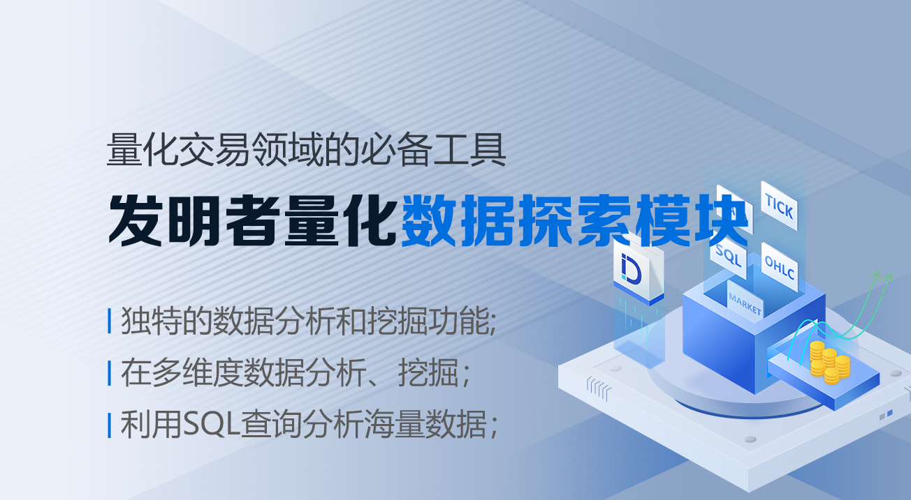
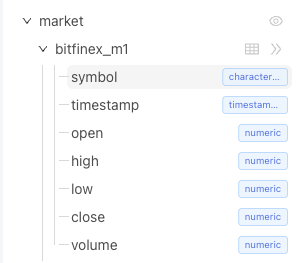
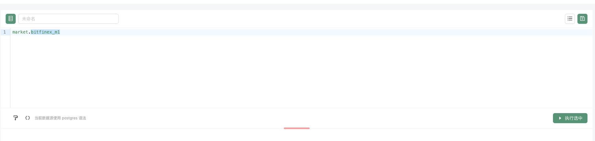
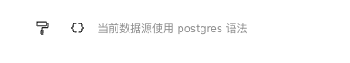
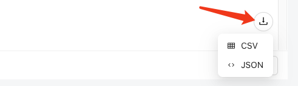
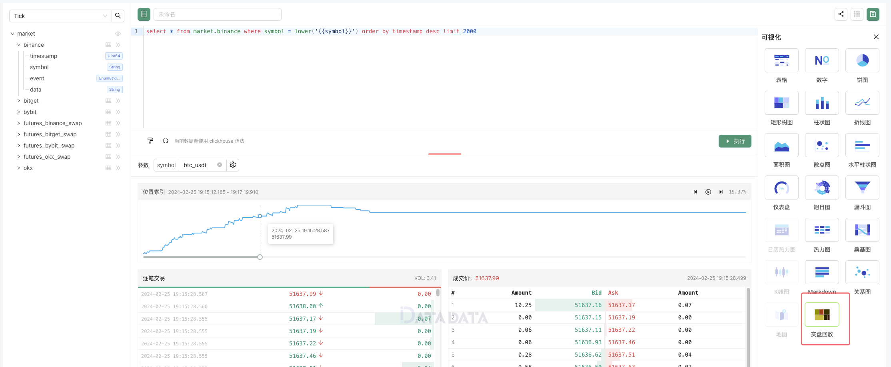

import { DatadataEmbeddedViewer } from '@site/src/components/datadata-embedded-viewer';


:::tip
原文链接：[https://www.fmz.com/bbs-topic/10370](https://www.fmz.com/bbs-topic/10370)
:::



在当今金融市场的激烈竞争中，量化交易作为一种基于数据分析和算法模型的交易策略，正在成为投资者和交易员们越来越青睐的选择。而在量化交易的领域中，
数据的价值愈发凸显，因此，一套高效、可靠的量化数据探索工具成为了实现成功交易的不可或缺的关键之一。

{/* truncate */}

在这个日益重视数据驱动决策的时代，发明者量化数据探索模块应运而生。作为量化交易领域的必备工具之一，它不仅仅是一款普通的数据分析软件，
更是一项革命性的创新，为投资者提供了独特的数据分析和挖掘功能，助力他们在复杂多变的金融市场中把握机会、降低风险。

FMZ量化作为专业的量化交易平台，有众多量化交易工具支持。目前FMZ量化平台「数据探索」模块已经集成了datadata平台的服务，
使用户在多维度数据分析、挖掘；可视化数据；探索交易策略等方面更具优势。FMZ量化自研的datadata平台是一个量化金融数据平台。
利用SQL查询分析海量数据，并通过可视化界面进行配置，生成适合数据分析的多种图表并于团队分享，让你轻松掌握市场动态，把握投资机会！

## FMZ量化数据探索模块

首先熟悉一下FMZ量化的[数据探索](https://www.fmz.com/m/database)模块，使用如同在datadata上一样。
对于每个FMZ平台用户我们无需再次注册datadata平台，直接可以使用datadata平台的各项功能。


### 1、数据区域

左侧的列表显示目前已经支持上线的数据内容，目前支持各交易所（平台）的K线数据（OHLC）、Tick数据。后续会支持更多类型、维度的数据。
这些数据都是持续实时更新的，让你始终掌握市场动态。

例如我们选择「OHLC」，再选择 market -> bitfinex_m1 ，点击展开之后可以看到这个表对象中的各个「字段名」。



点击表格图表，可以预览部分数据。

平台还支持上传自己的数据，点击列表最下方的「上传数据」按钮，即可上传数据。

> 从您的设备上上传CSV文件到服务器，文件大小应不超过 10 MB， 最多 10000 行 和 128 列。

### 2、SQL语句编辑区



这里就是编写具体查询语句的编辑框，稍后我们会展示两个有趣的例子，我们先了解一下其它功能。



这里有两个控件按钮，第一个可以很方便的格式化SQL语句。
第二个按钮用来插入SQL语句中使用的变量，类似于给SQL查询添加了一个可实时修改的参数（不用把一些查询条件硬编码在SQL语句中）。
例如：


在参数test中输入 `1inch_usd` 然后点击右侧「执行」按钮，就可以查询出所有 1inch_usd 这个品种的数据。
查询出来的数据还可以导出，下载到本地：



支持JSON、CSV格式。

如果希望保存记录这个SQL查询，可以点击右上角的「保存」按钮，把这个SQL查询记录到当前FMZ账户「数据探索」的资源列表中（资源列表按钮在保存按钮左侧），
方便以后使用。

目前我们看到的界面简洁、功能简单，但是实际使用时就会体验到这个工具的强大用途。接下来我们看两个复杂一点的例子。

## 波动排行

```sql
SELECT
    UPPER(REPLACE(symbol, '_usdt.swap', '')) as symbol,
    ((MAX(high) - MIN(low)) / AVG((high + low) / 2)) AS volatility_percentage
FROM
    market.futures_binance_d1
WHERE
    timestamp >= CURRENT_DATE - INTERVAL '{{days}} day' and symbol like '%.swap'
GROUP BY
    symbol
ORDER BY
    volatility_percentage {{rank}}
LIMIT
    {{limit}};
```

这段 SQL 代码用于从表 "market.futures_binance_d1" 中获取交易对符合条件的波动率百分比，并按照波动率百分比进行排序和限制数量输出。

这段SQL的解释如下：

1. 使用了两个表达式进行计算，一个是将 "symbol" 列中的 '_usdt.swap' 替换为空字符串，并将结果转换为大写，另一个是计算 `(MAX(high) - MIN(low)) / AVG((high + low) / 2)`。
   第一个表达式使用了 REPLACE 函数将符合条件的字符串进行替换，然后使用 UPPER 函数将结果转换为大写。
   第二个表达式计算了最高价与最低价的差值除以最高价与最低价的平均值，以计算波动率百分比。
2. FROM 子句：指定了要查询的数据表为 `market.futures_binance_d1`。
3. WHERE 子句：
   使用了两个筛选条件：`timestamp >= CURRENT_DATE - INTERVAL '{{days}} day' 和 symbol like '%.swap'`。
   第一个条件筛选出最近 `{{days}}` 天内的数据。
   第二个条件筛选出 "symbol" 列以 '.swap' 结尾的交易对。
4. GROUP BY 子句：根据 "symbol" 列进行分组。
5. ORDER BY 子句：根据波动率百分比进行排序，可以选择升序（ASC）或降序（DESC），根据 `{{rank}}` 参数而定。
6. LIMIT 子句：限制输出结果的数量，可以根据 `{{limit}}` 参数进行设置。


当我们输入参数：

days: 10 , rank: DESC , limit: 10 点击「执行」按钮，就可以执行SQL语句，查询出结果。

数据除了以表的形式展示，还可以以各种可视化方式展示，在设置好可视化的一些相关设置后，就会以更加丰富生动的方式展示出来数据。


创建的查询还可以生成连接，方便分享，而且还可以修改参数，更新查询（文章此处就可以尝试修改一下参数更新查询）。以下是实时数据生成图表：

:::warning
请到[原文章处查看](https://www.fmz.com/bbs-topic/10370#%E6%B3%A2%E5%8A%A8%E6%8E%92%E8%A1%8C)。
:::

{/* <DatadataEmbeddedViewer region="global" queryId="9d828b52-539c-47fd-984a-816a38e3f2ef" /> */}

## 深度回放

接下来我们要学习一个研究市场微观场景的例子，这是一个研究高频交易细节的绝好工具。

```sql
select * from market.binance where symbol = lower('{{symbol}}') order by timestamp desc limit 2000
```

使用以上SQL语句查询某个品种的Tick级别行情数据，


本例子的SQL查询就非常简单了，仅仅是查询binance交易所中某个品种（根据参数symbol指定）的Tick数据。

重点在于，把数据以实盘回放形式，在时间序列上，多个图表展示出来：



是不是很方便研究盘口中的细节。

接下来我们来看下如何分享我们的研究，可以点击右上角的分享图标/upload/asset/16a8485d994aec8a93a4.png 。


这些分享的代码、链接，可以嵌入FMZ平台社区帖子、文章。可以嵌入网页，可以转载到其它社区、论坛等。也可以直接分享给任何人。

{/* TODO */}

这个强大的量化交易工具，你还在等什么？赶紧来尝试挖掘数据、分析数据吧。
