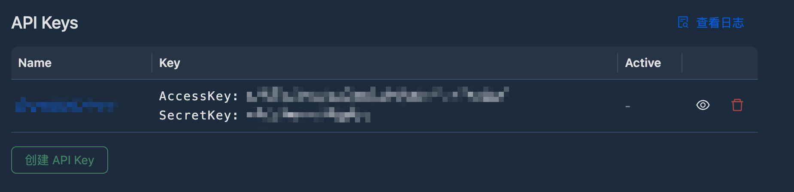

import TabItem from "@theme/TabItem";
import Tabs from "@theme/Tabs";

Datadata API 依赖 API-Token 进行身份验证，API-Token 由 **AccessKey** 和通过 **SecretKey** 加密的 Payload 组成，
本章将详细介绍 SecretKey 的获取方式和对 Payload 的加密步骤。

## 创建您的 API-Key

:::tip
API-Key 由 AccessKey 和 SecretKey 两部分组成。
:::

要生成新的 API-Key，请登录后点击顶部导航的用户头像，选择`用户设置` -> `API` -> `创建 API Key`。

然后输入 API-Key 名称，名称用于帮助您记忆此 API-Key 的用途，点击确定后，您就可以看到当前 API-Key 对应的 AccessKey 和 SecretKey 了。



:::danger
AccessKey 是公开的，用户区分用户身份；SecretKey 是私密的，用于加密 Payload 数据，请妥善保管您的 **SecretKey**！
:::

## Payload

Payload 是 API-Token 中携带的信息，其格式为 JSON，包括 3 个字段，如下。

| 字段    | 类型   | 描述                                                                                     |
| ------- | ------ | ---------------------------------------------------------------------------------------- |
| expired | number | 可选。Token 过期时间，值是 Unix 时间，即自 1970 年 1 月 1 日（世界协调时）起经过的秒数。 |
| host    | string | 可选。 签发此 Token 的身份，值是 Token 签发方的域名。                                    |
| uid     | string | 可选。 子用户的 UID，如果有值，则认为是子用户。                                          |

示例：

```json showLineNumbers
{
  "uid": "007",
  "host": "www.example.com",
  "expired": 1741058185
}
```

## 生成 API-Token

API-Token 由两部分组成，第一部分是 AccessKey ，第二部分是使用 SecretKey 和 AES-CFB 加密算法对 Payload 加密后的密文，中间使用 `.` 连接。

下面是加密算法的示例代码。

<Tabs groupId="programming-language" className="unique-tabs" queryString={true}>
  <TabItem value="go" label="Go" default>
    点击此处在 [Go Better Playground](https://goplay.tools/snippet/NuHPy8AwF0S) 或 [Go Playground](https://go.dev/play/p/5SvNGV5C_ac) 上运行。

    ```go showLineNumbers
    package main

    import (
      "crypto/aes"
      "crypto/cipher"
      "crypto/rand"
      "encoding/hex"
      "encoding/json"
      "fmt"
      "io"
      "strings"
      "time"
    )

    type TokenPayload struct {
      UID     string `json:"uid"`
      Host    string `json:"host"`
      Expired int64  `json:"int64"`
    }

    type APIKey struct {
      AccessKey string
      SecretKey string
    }

    func (apiKey *APIKey) generateAPIToken(payload TokenPayload) (token string, err error) {
      var value []byte
      value, err = json.Marshal(payload)
      if err != nil {
        return "", err
      }

      var ciphertext string
      ciphertext, err = apiKey.encrypt(value)
      if err != nil {
        return "", err
      }

      return fmt.Sprintf("%s.%s", apiKey.AccessKey, ciphertext), nil
    }

    func (apiKey *APIKey) decryptAPIToken(token string) (payload *TokenPayload, err error) {
      var tokenParts = strings.Split(token, ".")
      if len(tokenParts) != 2 {
        return nil, fmt.Errorf("invalid api token")
      }
      var ciphertext = tokenParts[1]

      var value []byte
      value, err = apiKey.decrypt(ciphertext)
      if err != nil {
        return nil, err
      }

      payload = new(TokenPayload)
      err = json.Unmarshal(value, payload)
      if err != nil {
        return nil, err
      }

      return payload, nil
    }

    func (apiKey *APIKey) encrypt(value []byte) (string, error) {
      block, err := aes.NewCipher([]byte(apiKey.SecretKey))
      if err != nil {
        return "", err
      }

      ciphertext := make([]byte, aes.BlockSize+len(value))

      iv := ciphertext[:aes.BlockSize]
      if _, err := io.ReadFull(rand.Reader, iv); err != nil {
        return "", err
      }

      cipher.NewCFBEncrypter(block, iv).XORKeyStream(ciphertext[aes.BlockSize:], value)

      return hex.EncodeToString(ciphertext), nil
    }

    func (apiKey *APIKey) decrypt(ciphertext string) ([]byte, error) {
      block, err := aes.NewCipher([]byte(apiKey.SecretKey))
      if err != nil {
        return nil, err
      }

      cipherData, err := hex.DecodeString(ciphertext)
      if err != nil {
        return nil, err
      }

      iv := cipherData[:aes.BlockSize]
      cipherData = cipherData[aes.BlockSize:]

      cipher.NewCFBDecrypter(block, iv).XORKeyStream(cipherData, cipherData)

      return cipherData, nil
    }

    func main() {
      var err error = nil

      var apiKey = &APIKey{
        AccessKey: "xxxxxxxxxx",
        SecretKey: "xxxxxxxxxx",
      }

      var payload = TokenPayload{
        Expired: time.Now().AddDate(1, 0, 0).Unix(),
      }

      var token string
      token, err = apiKey.generateAPIToken(payload)
      if err != nil {
        panic(err)
      }

      fmt.Printf("token: %v\n", token)

      var decodedPayload *TokenPayload
      decodedPayload, err = apiKey.decryptAPIToken(token)
      if err != nil {
        panic(err)
      }

      fmt.Printf("decodedPayload: %#v\n", decodedPayload)
    }
    ```
  </TabItem>
  <TabItem value="node" label="Node">
    ```ts
    // TODO
    ```
  </TabItem>
  <TabItem value="python" label="Python">
    ```ts
    // TODO
    ```
  </TabItem>
  <TabItem value="java" label="Java">
    ```ts
    // TODO
    ```
  </TabItem>
</Tabs>


## 发起请求

完成上一步之后，我们拿到了 API-Token ，现在我们就可以开始发起 API 请求了。

发起任何 API 请求之前，我们需要将上一步获取到的 API-Token 附加到请求中，有两种方式：

1. 将 Token 添加到 Request Header 中，这是我们推荐的方式，属性名称是 `x-datadata-api-token`。
2. 将 Token 添加到 Query 中，适用于您无法修改 Request Header 的情况，通常是不推荐的。属性名称是 `api_token`。


例如，使用 Curl 发起请求，分页获取当前当前用户所有的 Charts 列表：

```shell
curl https://www.datadata.cn/api/v1/charts \
  -H 'x-datadata-api-token: <your-token>'
```

:::tip
更多 API 端点请查看 API-Endpoints 章节。
:::
