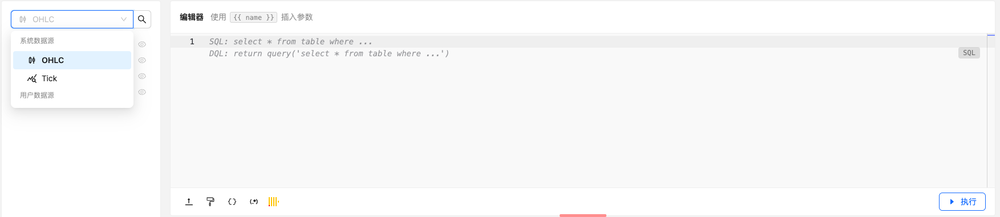
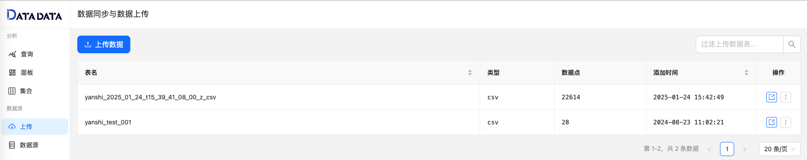
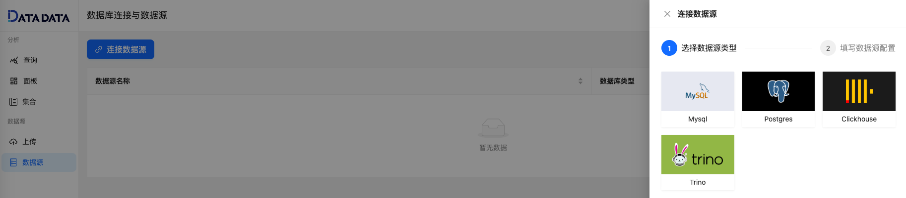

### 系统数据源

1. **数字货币市场数据**  
   提供来自全球多个交易所的实时数字货币市场数据，包括现货市场与衍生品市场的 OHLC（开盘价、最高价、最低价和收盘价）数据，覆盖不同交易对和合约。  
   - **交易对市场信息（Markets）**：包括每个交易对的市场信息，如上架交易所、价格精度、交易量精度和最小交易量等。
   - **多时间维度数据（Klines）**：涵盖永续合约资金费率信息，和现货和期货交易对的多个时间维度周期（1 分钟、15 分钟、1 天）行情数据，帮助用户进行全方位市场分析。

2. **Tick 数据**  
   提供实时 Tick 级别的细粒度数据，记录每一笔交易的价格和数量变化。支持 **模拟回放**，帮助用户从微观层面分析市场波动，并验证交易策略。

3. **链上数据**  
   未来将接入区块链数据，包括链上交易、持仓分布等深度信息，为用户提供更加深入的市场洞察。

### 用户数据源

1. **上传数据源**  
   用户可以将自有数据上传至平台，并与系统自带的数据源进行联动分析。支持灵活的数据融合，满足个性化研究需求。

2. **连接外部数据源**  
   DATADATA 支持连接多种外部数据库，包括 **MySQL**、**Postgres**、**Clickhouse**、**Trino** 等。通过将外部数据源与平台结合，用户能够利用平台强大的数据分析能力，对自有数据库进行深度挖掘与分析。

