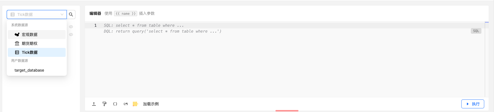
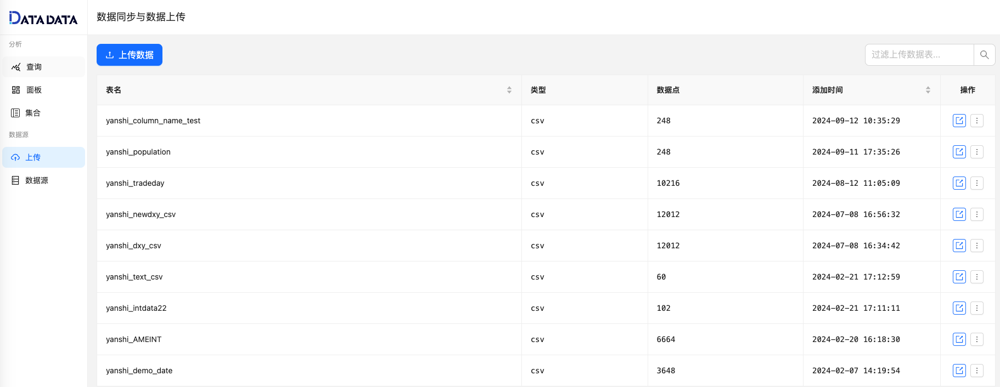
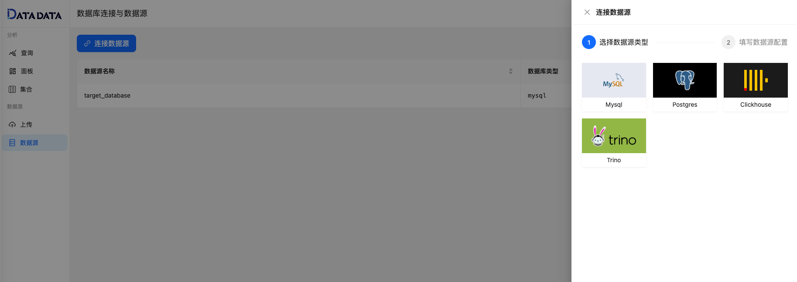

## 系统数据源

1. **宏观数据**  
   汇聚了来自国家公开数据源的各类重大政治、经济和人口指标，涵盖月度、季度和年度报表。适用于从宏观视角进行市场趋势分析和验证。

2. **期货期权数据**  
   提供国内六大商品期货交易所（上期所，大商所，郑商所，上能源，广汽所，中金所）和国际主要交易所的实时价格、持仓数据。用户可方便地了解市场整体走势、关注各品种的历史价格波动和持仓变化。

3. **Tick数据**  
   包含各类商品期货品种的实时Tick级别数据，支持实盘回放，帮助用户从微观层面分析品种的涨跌动态、价格波动及交易量变化。

## 用户数据源

1. **上传数据源**  
用户可将自有数据上传至平台，并与系统自带的数据源进行联动分析。支持灵活的数据融合，满足个性化研究需求。

2. **连接外部数据源**  
DATADATA支持连接多种外部数据库，包括 **MySQL**、**Postgres**、**Clickhouse**、**Trino** 等。通过将外部数据源与平台结合，用户能够利用平台强大的数据分析能力，对自有数据库进行深度挖掘与分析。

