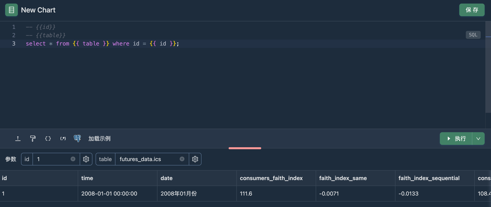

查询参数是指在查询中可以使用占位符来传递的动态值。占位符的语法为 `{{ var }}`。

在 SQL 查询中，可以在任意位置插入 `{{ var }}` 来创建一个参数，例如

```sql
select * from table where id = {{ id }}
```

在 DQL 中，只能在 [`query`](../02_dql/global.md#query) 函数中使用 `{{ var }}` 来创建一个参数，例如

```python
return query("select * from table where id = {{ id }}")
```

另外您可以在 DQL 中使用 `args` 全局变量来获取任意参数的值，如

```python
# {{ id }}
print(args["id"])
```

## 参数类型

目前支持的查询参数类型有：

1. [Text](#text)
2. [Number](#number)
3. [Date](#date)
4. [DateRange](#date-range)
5. [List](#list)
6. [Dynamic List](#dynamic-list)
7. [Query Based List](#query-based-list)

### Text

此参数类型用于输入一个文本。
在 SQL 中使用时，您可能需要根据实际情况添加引号，如

```sql
select * from table where name = '{{name}}'
```

### Number

此参数类型用于选择一个数字，输出格式为数字 `123`。

### Date

此参数类型用于选择一个日期，输出格式为字符串 `2024-08-06`。

### Date Range

此参数类型用于选择一个日期范围，输出格式为字符串 `2024-08-06 00:00:00,2024-08-13 23:59:59`。

在 SQL 使用时需要配合参数修饰符 start 和 end，如

```sql
-- {{ dateRange }}
select * from table where date between '{{ dateRange:start }}' and '{{ dateRange:end }}'
```

### List

在开启多选时，需要配合修饰符 `:in` 一起使用，如

```sql
-- {{ platforms }}
select * from table where platform in ({{ platforms:in }})
```

### Dynamic List

与 List 静态声明选择的区别是，有些场景可能需要动态获取列表选项。
Dynamic List 类型的参数支持使用 SQL 语句查询的结果作为选择，如

```sql
select distinct platform from table
```

您也可以查询两列分别作为选项的 `label` 和 `value` ，如

```sql
select platform_name as label, platform as value from table group by platform_name, platform
```

:::tip
请注意将所选择的列别名作为 `label` 和 `value` 以帮助程序识别。
:::

### Query Based List

和 Dynamic List 类似，但是您有时候可能需要编写一个比较复杂的 SQL，在 Dynamic List 的 UI 中编写多有不便。
这种情况下，您可以创建一个独立的 Query 查询来作为选项来源。

## 参数联动

参数联动功能依赖 [Dynamic List](#dynamic-list) 类型的参数实现。
在 Dynamic List 参数的 SQL 语句中，您可以使用 `{{ var }}` 占位符来插入其他参数的值作为依赖。
当依赖参数的值变化时，会自动重新执行 SQL 语句并更新选项列表，从而实现联动。

## 常见问题

### 如何调整参数的顺序？

参数的顺序是由其第一次出现的位置决定的，如 `select * from {{ table }} where id = {{ id }}` 中，`{{ table }}` 出现在 `{{ id }}` 之前。
如果想要调整参数 `table` 和 `id` 的顺序，可以先在注释中声明参数。然后在语句中再次使用，如：

```sql
-- {{id}}
-- {{table}}
select * from {{ table }} where id = {{ id }};
```

或者在 DQL 中：

```py
# {{id}}
# {{table}}
return query('select * from {{ table }} where id = {{ id }}')
```

效果如下


