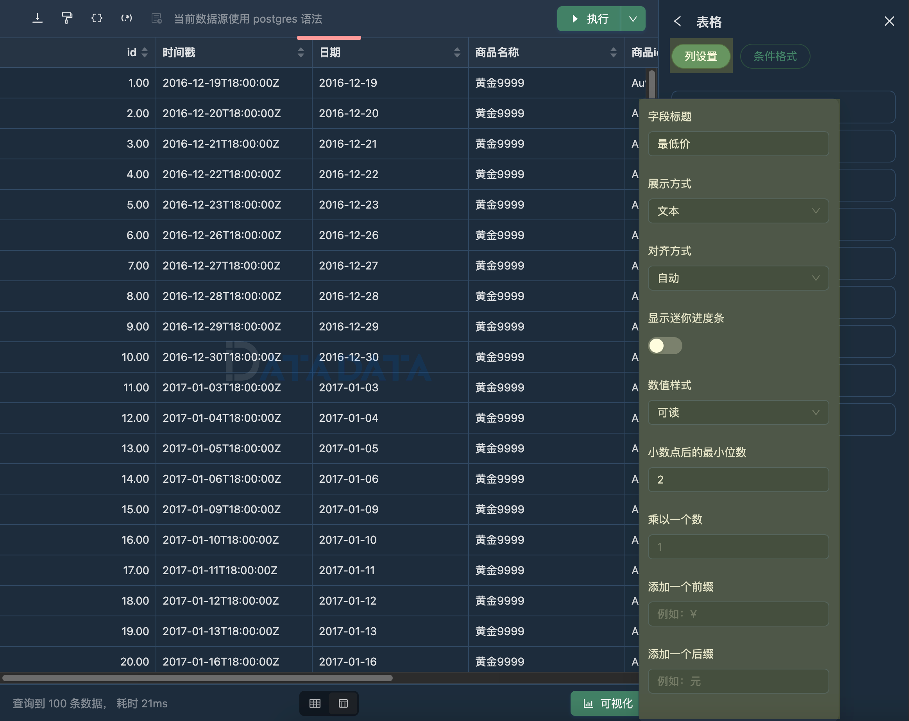

表格是一种常见的数据展示方式，通常用于以结构化的形式呈现数据，使得观察者能够直观地比较、分析和理解数据。
表格由行和列组成，行表示数据的条目或记录，列表示不同的数据字段或属性。

表格通常包含以下要素：

- 行（Row）：表格中的每一行代表一个数据条目或记录，包含不同数据字段的数值或信息。
- 列（Column）：表格中的每一列代表一个数据字段或属性，包含相同类型或相关信息的数据。
- 表头（Header）：表格的首行通常用来标识每一列的含义或名称，以便观察者能够理解表格中的数据内容。
- 单元格（Cell）：表格中的每个交叉点称为一个单元格，包含特定行和列的数据数值或信息。
- 边框（Border）：用于界定表格的边界，使得表格的结构更清晰明了。
- 标题（Caption）：可选的表格标题，用于描述表格所展示的内容或主题。

表格适用于展示结构化的数据、对比不同数据字段的数值、查找特定数据条目或进行数据分析。
它提供了一种直观的方式来浏览和理解数据，尤其适用于数据量较大或需要进行精确比较的情况。

## 主要功能

1. 支持设置数据显示格式，支持文本、超链接、电子邮件等格式。
2. 支持设置对齐方式。
3. 支持将数值展示为 mini 进度条。
4. 支持设置数值样式，支持可读、百分比、货币、文件大小、时长等格式。
5. 支持添加文本前缀、后缀。
6. 支持对数值进行计算变换，设置保留小数点位数等。

## 列设置

列设置的主要功能有：

1. 隐藏不需要展示的列。
2. 分别设置每列的数据格式。
3. 调整列显示的顺序。

## 条件格式

条件格式支持让您根据特定条件对某些单元格或者列进行高亮。

高亮支持单一颜色和颜色范围。
固定颜色表示只要满足条件，都同意使用一种颜色高亮，颜色色值支持从其他列获取。
颜色范围表示根据数据进行色阶高亮，颜色范围仅支持设置列。

