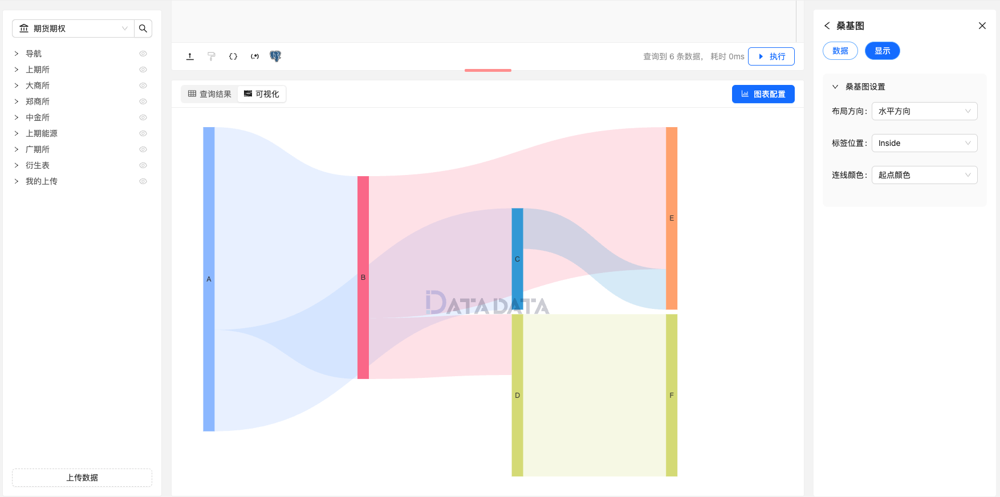

桑基图（Sankey Diagram）是一种流程图，用于可视化复杂系统中的能量、资源或资金等流动的路径和量级。
桑基图通常由一系列连续的箭头（流）组成，箭头的宽度代表流的量级，而箭头的起点和终点则表示流的来源和目的地。

桑基图通常包含以下要素：

- 节点（Node）：表示系统中的不同组成部分或阶段，每个节点代表一个来源或目的地。节点通常由矩形或圆形表示，并附带标签，以标识其名称或含义。
- 流（Flow）：表示能量、资源或资金等在系统中的流动路径和量级。流由箭头表示，箭头的宽度通常反映了流的量级，而箭头的起点和终点分别对应着流的来源和目的地。
- 标签（Label）：流的箭头或节点通常附带标签，用于描述其名称、数值或其他重要信息，以帮助观察者理解图表中的内容。

桑基图适用于展示系统中复杂的能量流动或资源分配情况，特别适用于分析复杂系统的结构和效率。
它能够直观地展示不同部分之间的关系和交互，帮助观察者发现潜在的优化和改进方向。

## 使用方式

首先，编写合适的 SQL 查询出数据，数据要求有：

1. **起始节点**和**目标节点**不能重复。
2. **数值字段**需要为数值类型。 

```py
data = {
    "Source": ["A", "A", "B", "B", "C", "D"],
    "Target": ["B", "C", "D", "E", "E", "F"],
    "Value": [100, 50, 30, 70, 20, 80]
}

# 转换为 DataFrame
df = DataFrame(data)

return df 
```

## 桑基图设置

您可以通过以下设置来调整桑基图的显示效果：

### 数据

1. **起始节点**：表示流的起点节点。
2. **目标节点**：表示流的目标节点。
3. **数值字段**：表示从起始节点到目标节点的流动量。

### 显示

1. **布局方向**：设置桑基图的布局方向（垂直/水平）。
2. **标签位置**：设置节点和流的标签显示位置。
3. **连线颜色**：设置流的连线颜色。


