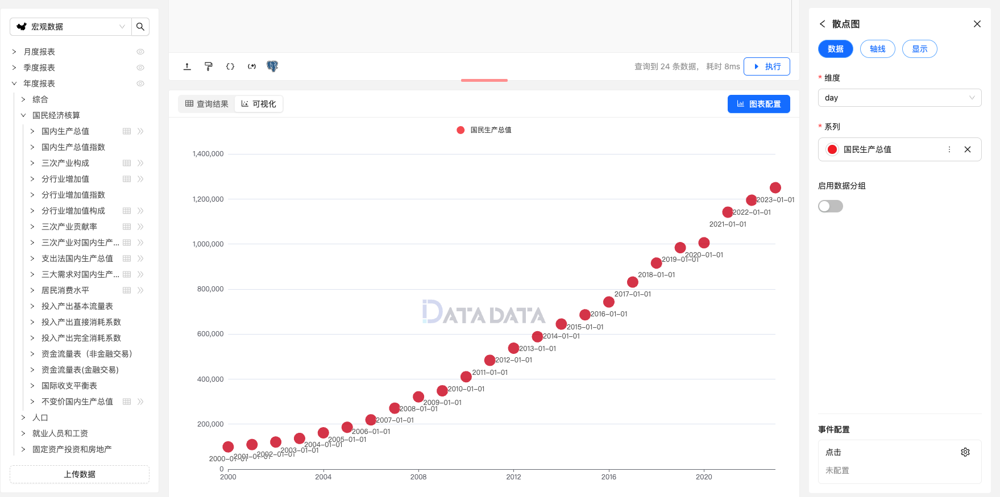

散点图（Scatter Plot）是一种常用的数据可视化图表类型，用于展示两个变量之间的关系或趋势。
散点图通常由一系列点组成，每个点代表数据中的一个观测值，横坐标和纵坐标分别表示两个变量的取值。通过观察散点图的分布情况，可以直观地了解两个变量之间的相关性、趋势或异常情况。

散点图通常包含以下要素：

- 数据点（Data Points）：散点图由多个数据点组成，每个数据点代表数据集中的一个观测值。数据点通常用符号或标记表示，例如圆圈、方块或叉号等。
- 横轴（X 轴）：横轴表示第一个变量的取值范围，通常用于展示自变量或独立变量。
- 纵轴（Y 轴）：纵轴表示第二个变量的取值范围，通常用于展示因变量或因果变量。
- 标签（Labels）：散点图的横轴和纵轴通常附带标签，用于描述变量的名称或含义。

散点图适用于探索两个变量之间的关系，特别适用于发现变量之间的相关性、趋势或异常值。
它能够直观地展示数据的分布情况，帮助观察者理解变量之间的关系和相互作用。


## 使用方式

首先，编写合适的 SQL 查询获取数据，数据要求如下：

1. **横轴字段(维度)**和**纵轴字段(系列)**均需为数值类型。  
2. 数据需要清洗，以去除缺失值和异常值，确保展示效果。  

例如，以下是获取数据的 SQL 查询：

```sql
SELECT * 
FROM yearly.a0201 
WHERE name = '国民总收入亿元';
```

### 显示设置

除了常规设置外，散点图需要注意以下两个关键设置：

### 1. **散点大小**
   - 支持定义散点的尺寸，用于表示某一维度的数据大小。例如，市场份额、成交量等指标可以通过散点的大小进行直观表达。

### 2. **散点名称**
   - 为每个散点设置名称，标明其对应的数据点或分类，便于观众理解数据内容。

这两个设置可以帮助散点图更加直观地表达数据内容，同时提升图表的交互性和可读性。


### 图例


