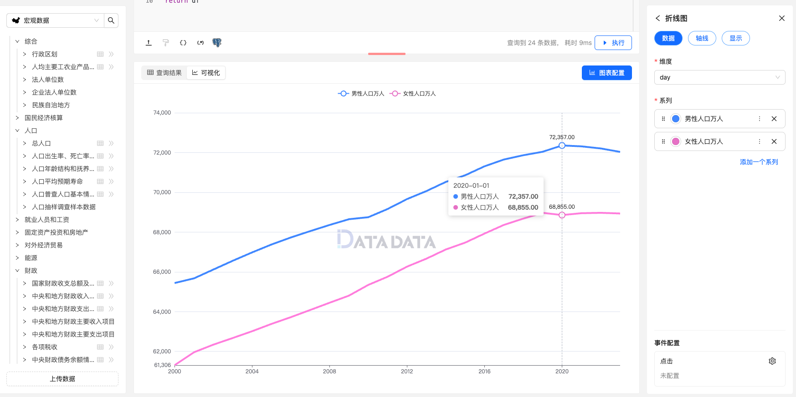

折线图是一种常见的数据可视化图表类型，用于展示数据随着时间、类别或其他变量的变化趋势。
它通过连接各个数据点的折线来显示数据的变化情况，使观察者能够直观地了解数据的趋势、周期性以及可能的模式或异常。

折线图通常包含以下要素：

- 横轴（X 轴）：横轴通常表示时间、类别或其他连续型变量，用于标识数据点的位置。
- 纵轴（Y 轴）：纵轴表示数据的数值大小，用于标识数据点在纵向上的位置。
- 折线：折线连接了各个数据点，直观地显示了数据的变化趋势。折线的形状、斜率和曲线程度都可以提供有关数据特征的信息。
- 数据点：在折线上标记的数据点表示具体的数据数值，以便观察者能够准确地了解每个时间点或类别的数据情况。

折线图适用于展示时间序列数据、趋势分析、周期性变化以及对比不同类别之间的变化。
它可以帮助观察者快速识别数据的整体趋势、周期性波动以及可能存在的异常情况。

## 使用方式


1. **维度字段**：用于表示折线图的 X 轴，通常为时间、日期或分类字段。
2. **系列字段**：表示每条折线对应的类别。 


### 数据示例

```py
# 创建 DataFrame
data = query('select * from yearly.a0301')

# 转换为 DataFrame
df = DataFrame(data)

df = df.pivot(index="day", columns="name", values="value")

return df
```


## 折线图设置

### 显示设置

常规折线图提供了丰富的设置选项，让您可以灵活调整图表样式、数据展示方式以及交互效果，以便更好地传达数据趋势和关键信息。以下是常规折线图的主要设置项及其优化扩展：

### 1. **线条设置**
   - **线条粗细**：您可以自定义折线的粗细，确保折线在图表中显眼且易于辨识。粗细设置对于多个折线图的区分尤为重要。
   - **线条颜色**：设置折线的颜色，可以通过颜色映射不同的系列或数据区间，增强图表的视觉层次感和信息传递效果。
   - **线型选择**：可选择实线、虚线、点线等不同类型的折线，根据展示需求调整折线的外观，便于区分不同的数据趋势。

### 2. **空值处理**
   - **是否连接空值**：您可以设置是否连接数据中的空值（如缺失数据点）。如果选择连接空值，折线将通过直线连接空值前后的数据点，这对于某些趋势分析非常有用。若选择不连接，空值处将显示为中断状态，帮助强调数据的不完整性或缺失情况。

### 3. **折线端点标签**
   - **显示折线端点标签**：在折线图的起点或终点添加数据标签，使得观众能够直接看到关键数据点的具体数值。这对于重要时间点或关键数据的展示尤为有效。

### 4. **数据显示数值**
   - **数值显示**：在折线图中显示数据点的具体数值，增强图表的可读性。数值可显示在数据点的旁边或直接在线条上方，帮助用户快速理解每个数据点的具体值。

### 5. **标线设置**
   - **添加标线**：在折线图中插入标线，帮助用户识别特定的数值阈值或趋势。例如，您可以设置一条平均值线，或是一个特定的数据目标线，帮助对比数据和关键值。


### 图例


