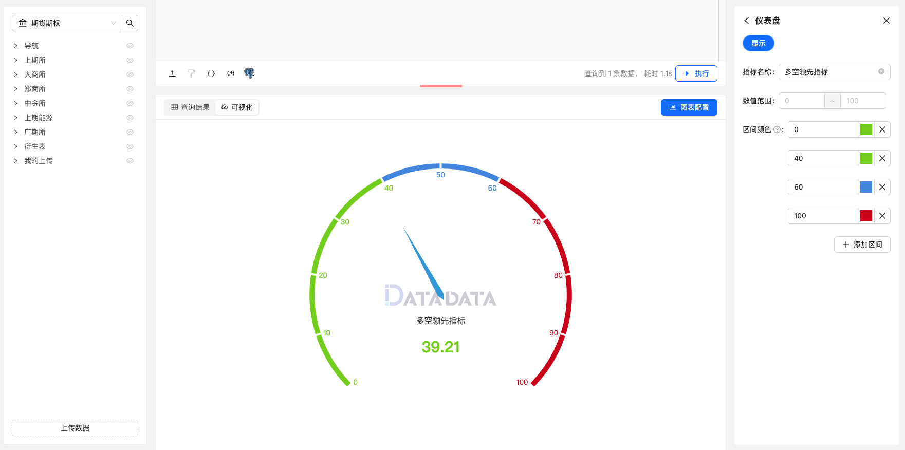

仪表盘图（Gauge Chart）是一种用于展示单一数值在预设范围内的相对位置的图表类型。
它通常呈现为一个半圆或圆形的表盘，其中包含一个指针指示当前数值在预设范围内的位置。
仪表盘图通常用于显示实时数据或监控指标，例如仪表盘的读数、指标的达成率等。

仪表盘图通常包含以下要素：

- 指针（Pointer）：指针指示当前数值在预设范围内的相对位置。指针的位置通常与数据数值相关联，反映了数值在预设范围内的相对大小。
- 刻度（Scale）：刻度标记沿着仪表盘的边缘或内部，用于标识预设范围内的数值划分或间隔。刻度通常标注有数值或标签，以便观察者能够直观地理解数值的大小。
- 指示器（Indicator）：指示器通常是一条线或区域，用于标识预设范围内的安全区域、警戒区域或目标区域，以帮助观察者快速判断当前数值的相对位置是否符合预期。

仪表盘图适用于展示单一数值在预设范围内的相对位置，特别适用于监控和实时数据展示。
它能够直观地反映数据的相对大小，并帮助观察者快速了解当前数值的状态和趋势。

## 使用方式

仪表盘支持显示一个区域数值，并且可以配置其显示格式。

## 仪表盘设置

### 显示设置

1. **数值范围**：设置仪表盘最小最大数值范围。
2. **区间颜色**：划分不同区间范围，并设置不同范围等级颜色。  

### 图例

