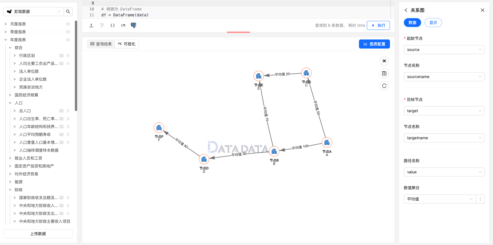

关系图（Network Graph）是一种用于可视化网络结构的图表类型，通常用于展示节点（或顶点）之间的关系和连接。
关系图由节点和边组成，节点代表网络中的实体，而边代表节点之间的关系或连接。
关系图可用于表示各种复杂系统，如社交网络、网络拓扑、组织结构等。

关系图通常包含以下要素：

- 节点（Node）：关系图中的主要组成部分，代表网络中的实体或对象。每个节点通常具有唯一的标识符，并可能具有其他属性，如名称、类别或数值。
- 边（Edge）：连接节点之间的线条，代表节点之间的关系或连接。边可以是有向的或无向的，有向边表示连接的方向，无向边表示连接没有方向性。
- 标签（Label）：节点和边通常可以附加标签，用于描述节点的名称或属性，以及边的关系或权重。
- 布局（Layout）：关系图的布局方式可以影响节点和边的排列方式，常见的布局算法包括圆形布局、力导向布局、层次布局等。

关系图适用于可视化复杂系统中的节点和连接关系，特别适用于分析网络结构、关系网络、组织结构等。
它能够直观地展示节点之间的关系和连接，帮助观察者理解网络的结构和特征。

## 使用方式


1. **起始节点**：选择起始节点。
1. **节点名称**：定义起始节点名称。
1. **目标节点**：选择目标节点。
1. **节点名称**：定义目标节点名称。
1. **路径名称**：选择路径名称。
1. **数值聚合**：定义路径数值聚合方式。


### 数据示例

```py
data = {
    "Source": ["A", "A", "B", "B", "C", "D"],
    "Target": ["B", "C", "D", "E", "E", "F"],
    "Value": [100, 50, 30, 70, 20, 80],
    "SourceName": ["节点A", "节点A", "节点B", "节点B", "节点C", "节点D"],
    "TargetName": ["节点B", "节点C", "节点D", "节点E", "节点E", "节点F"],
    "RouteName": ["路径A-B", "路径A-C", "路径B-D", "路径B-E", "路径C-E", "路径D-F"]
}

# 转换为 DataFrame
df = DataFrame(data)

return df 
```


## 关系图设置

### 显示设置

1. **关系图设置**：定义节点名称最大长度，节点地址最大长度，高亮阶段分支限制，以及连接线长度。


### 图例


