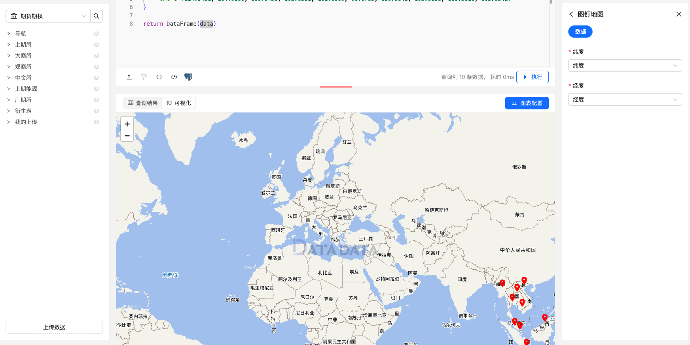

图钉地图是一种在地图上以图钉或标记点形式显示数据的地图。每个标记点代表地图上的一个具体位置，通常用来显示单个地点的详细信息或事件发生的位置。

地理位置坐标图通常包含以下要素：

地图背景（Map Background）：地理位置坐标图通常以地图作为背景，以便更直观地显示地理位置坐标的位置。地图背景可以是世界地图、国家地图、城市地图等。
地理位置标记（Location Markers）：用于标记地理位置的点位符号或标记。每个地理位置坐标通常用一个点位符号或者图标来表示，以便在地图上清晰地显示其位置。
坐标轴（Coordinate Axes）：地理位置坐标图通常包含经度和纬度的坐标轴，用于表示地球表面上的位置。经度通常位于横轴上，纬度通常位于纵轴上。

## 使用方式

图钉地图支持根据精确经纬度坐标，显示具体标记地图位置。

```py
# 东盟十国坐标
data = {
    "国家": ["文莱", "柬埔寨", "印度尼西亚", "老挝", "马来西亚", "缅甸", "菲律宾", "新加坡", "泰国", "越南"],
    "首都": ["斯里巴加湾市", "金边", "雅加达", "万象", "吉隆坡", "内比都", "马尼拉", "新加坡市", "曼谷", "河内"],
    "纬度": [4.8860, 11.5621, -6.2088, 17.9748, 3.1390, 19.7633, 14.5995, 1.3521, 13.7563, 21.0285],
    "经度": [114.9431, 104.9160, 106.8456, 102.6331, 101.6869, 96.0785, 120.9842, 103.8198, 100.5018, 105.8542]
}

return DataFrame(data)
```

### 图例


