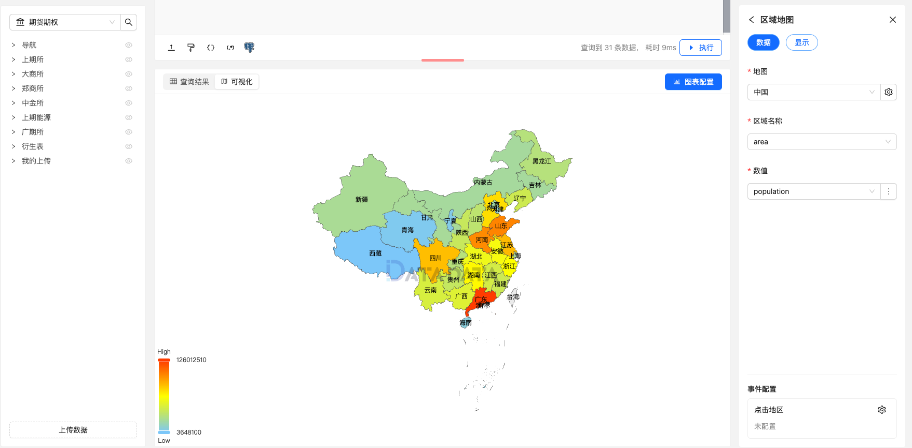

区域地图是通过不同的颜色或阴影来表示特定区域的数值数据。它通常用于展示地理区域（如国家、省份、城市等）内的某些数据分布，比如人口密度、收入水平、污染指数等。

这种图表通常将不同的地理区域（如国家、省份、城市等）与相关数据（如人口、销售额、气温等）结合，能够有效展示区域之间的差异与趋势。

## 使用方式

1. **地图字段**：选择地图的类型或基础地图，决定数据展示的地理区域。
2. **区域名称字段**：选择数据集中对应区域名称的字段，用于将数据与具体的地理位置进行映射。
3. **数值字段**：选择用于显示具体区域属性或数值的字段，如人口数量、气温、销售量等。

### 数据示例

```py
select * from "upload_yanshi_population"
```

## 区域地图设置

### 显示设置

1. **地图设置**：设置指标名称和标签是否显示。

### 图例


