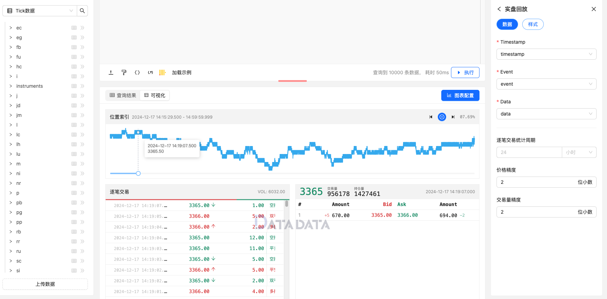

在金融市场的涌动中，盘口交易数据的深度分析和实时监控成为量化研究人员和交易员们获取洞察的必需工具。在这个背景下，盘口实时回放作为一项关键技术，为市场参与者提供了深入了解市场动态的途径，助力我们优化交易策略、降低风险、提升收益。

优宽平台为了满足用户的需求，结合流数据分布式表同步回放功能，开发出了盘口实时回放功能。这项功能可以帮助交易者在真实市场环境下模拟交易，并实时观察市场的动态变化。通过不断地实践和观察，交易者可以逐步培养自己的交易节奏，提高对市场的敏感度和把握能力。


## 使用方式


通过选择Tick数据，编写Sql代码选择目标期货品种，这样就可以获取到目标合约的Tick数据。然后我们可以将Tick数据进行实盘回放的展示，点击可视化按钮，选择实盘回放功能，这样就可以进入仿真实盘回放模块，点击开始回放，就可以看到和实盘一样的交易窗口，滚动呈现实时的交易信息。


### 数据示例

```py
select * from market.rb where symbol = 'rb2505' order by timestamp DESC limit 10000
```

## 盘口实时回放设置

### 数据设置

1. **Timestamp**：定义时间戳。
2. **Event**：定义事件。
3. **Data**：定义回放数据。


### 显示设置

1. **精度设置**：定义价格/交易量精度。
2. **样式设置**：选择K线涨跌模式。

### 图例


