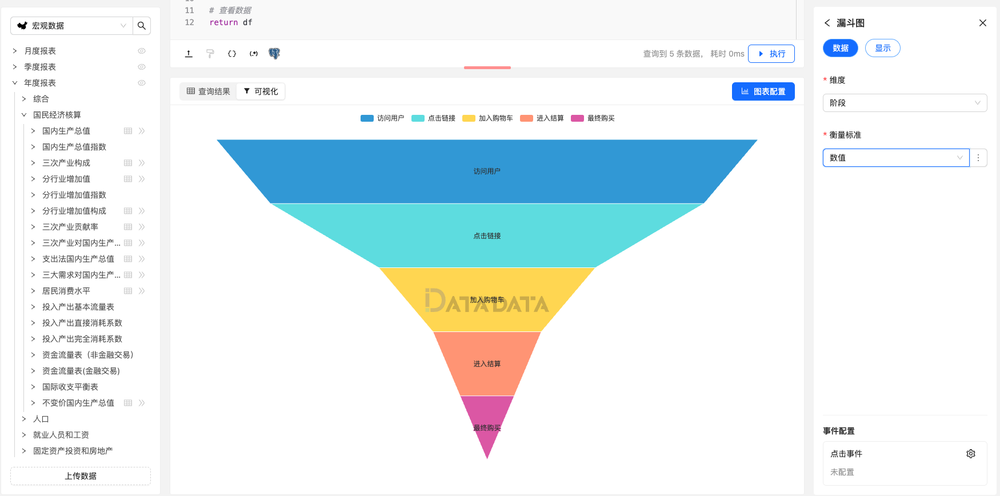

漏斗图（Funnel Chart）是一种数据可视化图表类型，用于展示数据在不同阶段之间的流动或转化过程。
漏斗图通常由一系列呈递减趋势的水平矩形组成，每个矩形代表一个阶段，而矩形的宽度则表示该阶段的数量或比例。
漏斗图通常用于描述销售、转化率或流程中的各个阶段的变化情况。

漏斗图通常包含以下要素：

- 阶段（Stage）：漏斗图的主要组成部分，由一系列水平矩形组成，每个矩形代表一个阶段或步骤。通常，阶段按顺序排列，且递减趋势。
- 矩形宽度（Width）：每个阶段的矩形宽度表示该阶段的数量或比例。通常，矩形的宽度与数据的大小成比例，因此随着阶段的推进，矩形宽度逐渐减小。
- 标签（Label）：每个阶段通常附带标签，用于标识该阶段的名称或含义，以便观察者能够理解图表中的内容。

漏斗图适用于展示流程中各个阶段的变化情况或转化率，特别适用于描述销售、营销或转化过程中的不同阶段的变化趋势。
它能够直观地展示数据的流动情况，帮助观察者了解流程中各个阶段的变化和影响。

## 使用方式

首先，编写合适的 SQL 查询获取数据，数据要求如下：

1. **维度字段**需为分类类型，用于表示漏斗的各个阶段。  
2. **衡量标准字段**需为数值类型，用于表示每个阶段对应的值。  

### 数据示例

```py
# 创建 DataFrame
data = {
    "阶段": ["访问用户", "点击链接", "加入购物车", "进入结算", "最终购买"],
    "数值": [1000, 800, 400, 200, 100],
    "标签": ["总访问用户", "点击链接的用户", "加入购物车的用户", "进入结算的用户", "最终购买的用户"]
}

return data
```


### 显示设置

以下选项可调整漏斗图的显示效果：

1. **漏斗图设置**：包括排序方式，层级间隔和标签位置。  
2. **图例设置**：具体设置图例边距，类型，方向和位置显示属性。  


### 图例


