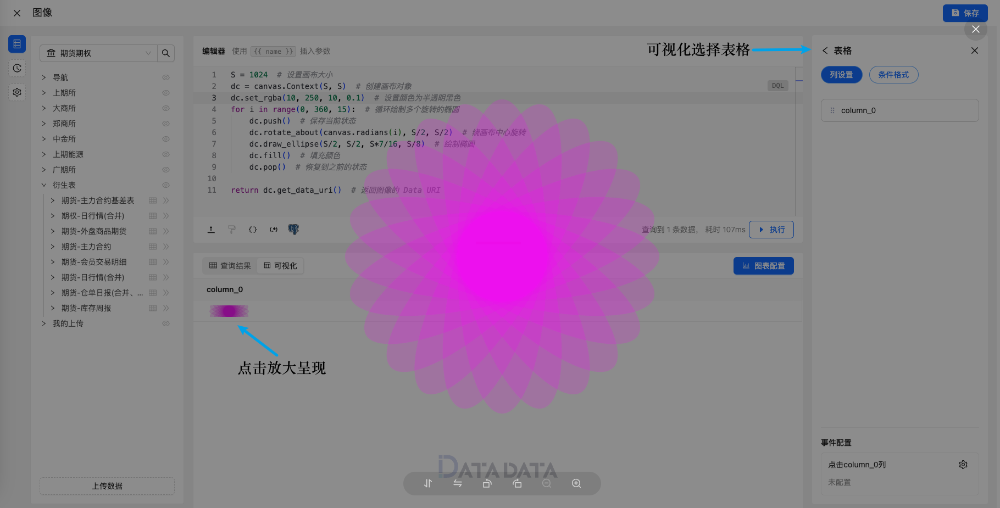

import Image00 from './00.png';
import Image01 from './01.png';

The Canvas module provides a concise set of APIs for drawing in DQL scripts.

Here is a simple example that draws a circle:

```python
dc = canvas.Context(1000, 1000)  # Create a canvas object, size 1000x1000
dc.draw_circle(500, 500, 400)  # Draw a circle centered at (500, 500) with radius 400
dc.set_hex_color("#FF0000")  # Set color to red
dc.fill()  # Fill the circle
return dc.get_data_uri()  # Return the image as a Data URI
```

Result:


:::tip
The Canvas API is based on [https://github.com/fogleman/gg](https://github.com/fogleman/gg). For more details, see [https://github.com/fogleman/gg](https://github.com/fogleman/gg).
:::

## API

```python
# Create a Context object with specified canvas size
canvas.NewContext(width: int, height: int)

# Convert degrees to radians
canvas.radians(degrees float64) float64

# Convert radians to degrees
canvas.degrees(radians float64) float64
```

## Context

`context` is similar to HTML Canvas API's `Context2D`, providing drawing-related functions.

### Drawing

```python
draw_point(x, y, r float64)  # Draw a point
draw_line(x1, y1, x2, y2 float64)  # Draw a line segment
draw_rectangle(x, y, w, h float64)  # Draw a rectangle
draw_rounded_rectangle(x, y, w, h, r float64)  # Draw a rounded rectangle
draw_circle(x, y, r float64)  # Draw a circle
draw_arc(x, y, r, angle1, angle2 float64)  # Draw an arc
draw_ellipse(x, y, rx, ry float64)  # Draw an ellipse
draw_elliptical_arc(x, y, rx, ry, angle1, angle2 float64)  # Draw an elliptical arc
draw_regular_polygon(n int, x, y, r, rotation float64)  # Draw a regular polygon
set_pixel(x, y int)  # Set a pixel

move_to(x, y float64)  # Move to specified coordinates
line_to(x, y float64)  # Draw a line to specified coordinates
quadratic_to(x1, y1, x2, y2 float64)  # Draw a quadratic Bézier curve
cubic_to(x1, y1, x2, y2, x3, y3 float64)  # Draw a cubic Bézier curve
close_path()  # Close the path
clear_path()  # Clear the path
new_sub_path()  # Create a new sub-path

clear()  # Clear the canvas
stroke()  # Stroke the path
fill()  # Fill the path
stroke_preserve()  # Stroke and preserve the path
fill_preserve()  # Fill and preserve the path
```

Often you want to center an image at a point.
Use `draw_image_anchored` with `ax` and `ay` set to `0.5` to do this.
Use `0` to left or top align.
Use `1` to right or bottom align.
`draw_string_anchored` does the same for text, so you don't need to call `measure_string` yourself.

### Text

```python
draw_string(s string, x, y float64)  # Draw text
draw_string_anchored(s string, x, y, ax, ay float64)  # Draw anchored text
draw_string_wrapped(s string, x, y, ax, ay, width, lineSpacing float64, align Align)  # Draw wrapped text
measure_string(s string) (w, h float64)  # Measure string width and height
measure_multiline_string(s string, lineSpacing float64) (w, h float64)  # Measure multiline string width and height
word_wrap(s string, w float64) []string  # Wrap text by width
```

### Color

```python
set_rgb(r, g, b float64)  # Set RGB color
set_rgba(r, g, b, a float64)  # Set RGBA color
set_rgb255(r, g, b int)  # Set RGB color (0-255 range)
set_rgba255(r, g, b, a int)  # Set RGBA color (0-255 range)
set_hex_color(x string)  # Set hex color
```

### Stroke and Fill

```python
set_line_width(lineWidth float64)  # Set line width
set_line_cap(lineCap LineCap)  # Set line cap style
set_line_join(lineJoin LineJoin)  # Set line join style
set_dash(dashes ...float64)  # Set dash pattern
set_dash_offset(offset float64)  # Set dash offset
set_fill_rule(fillRule FillRule)  # Set fill rule
```

### Gradients and Patterns

```python
new_linear_gradient(x0, y0, x1, y1 float64)  # Create linear gradient
new_radial_gradient(x0, y0, r0, x1, y1, r1 float64)  # Create radial gradient
new_conic_gradient(cx, cy, deg float64)  # Create conic gradient
```

### Transformations

```python
identity()  # Reset to default transform
translate(x, y float64)  # Translate
scale(x, y float64)  # Scale
rotate(angle float64)  # Rotate
shear(x, y float64)  # Shear
scale_about(sx, sy, x, y float64)  # Scale about a point
rotate_about(angle, x, y float64)  # Rotate about a point
shear_about(sx, sy, x, y float64)  # Shear about a point
transform_point(x, y float64) (tx, ty float64)  # Transform point coordinates
invert_y()  # Invert Y-axis direction
```

It is often necessary to rotate or scale around a point that is not the origin. For convenience, `RotateAbout`, `ScaleAbout`, and `ShearAbout` functions are provided.

`InvertY` is for when Y should increase from bottom to top instead of the default top-to-bottom.

### State Save/Restore

Save and restore context state. These can be nested.

```python
push()  # Save current state
pop()  # Restore previous state
```

### Clipping

Use clip regions to restrict drawing operations to the area defined by a path.

```python
clip()  # Enable clipping
clip_preserve()  # Enable clipping and preserve current path
reset_clip()  # Reset clip region
invert_mask()  # Invert mask
```

## Examples

Here is another example, drawing rotated ellipses:

```python
S = 1024  # Set canvas size
dc = canvas.Context(S, S)  # Create canvas object
dc.set_rgba(10, 250, 10, 0.1)  # Set color
for i in range(0, 360, 15):  # Loop to draw multiple rotated ellipses
    dc.push()  # Save current state
    dc.rotate_about(canvas.radians(i), S/2, S/2)  # Rotate around canvas center
    dc.draw_ellipse(S/2, S/2, S*7/16, S/8)  # Draw ellipse
    dc.fill()  # Fill color
    dc.pop()  # Restore previous state

return dc.get_data_uri()  # Return the image as a Data URI
```

## Presentation

When using DQL for Canvas drawing, the image needs to be presented within a table cell.


